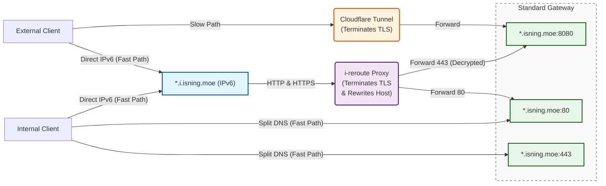

# Network Routing Architecture

This document outlines the ingress routing architecture for the cluster.
The design targeted at efficiently handles both internal and external traffic,
utilizing Split DNS for local access and a combination of
Cloudflare Tunnels and Direct IPv6 for external access.

## Architecture Diagram

## Traffic Flows

### 1. External Access (Slow Path)

* **Route:** External Client -> Cloudflare Tunnel -> Gateway (`:8080`)
* **Description:** Provides secure public access to `*.isning.moe` without exposing local ports. Cloudflare handles TLS termination.

### 2. IPv6 Direct Access (Fast Path)

* **Route:** Client -> `*.i.isning.moe` -> `i-reroute Proxy` -> Gateway (`:80` or `:8080`)
* **Description:** External or Internal clients with IPv6 support can bypass Cloudflare. The `i-reroute Proxy` terminates TLS, rewrites the Host header to `*.isning.moe`, and routes traffic based on the protocol.

### 3. Internal Access (Split DNS Fast Path)

* **Route:** Internal Client -> Gateway (`:80` or `:443`)
* **Description:** Local network clients resolve `*.isning.moe` directly to the local gateway IP via Split DNS, avoiding proxy overhead entirely.

## Core Components

* **Cloudflare Tunnel:** Secures external IPv4/general traffic. Terminates TLS before forwarding to the local network.
* **i-reroute Proxy:** A custom reverse proxy handling the `*.i.isning.moe` domain. Its primary jobs are TLS termination, Host header rewriting, and HTTP/HTTPS traffic splitting.
* **Standard Gateway:** The core entry point for the backend services.

## Gateway Port Mapping

| Port | Traffic Source | Description |
| --- | --- | --- |
| **80** | Internal Split DNS, `i-reroute` | Standard plain HTTP traffic. |
| **443** | Internal Split DNS | Standard HTTPS traffic (Gateway handles TLS). |
| **8080** | Cloudflare Tunnel, `i-reroute` | Decrypted HTTPS traffic forwarded from upstream proxies. |
