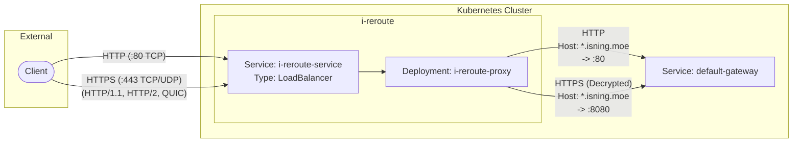

# i-reroute

A lightweight edge routing layer in Kubernetes for host rewriting and TLS termination.

**Purpose:** Routes inbound traffic from `*.i.isning.moe` to the standard external gateway handling `*.isning.moe`, acting as a pass-through proxy.

## Architecture Data Flow

## Routing Logic

The system utilizes Nginx to perform host rewriting before proxying the connection to the upstream Envoy gateway.

### Host Rewriting

* **Match:** Regex capture group `~^(?<subdomain>[^.]+)\.i\.isning\.moe$`
* **Rewrite:** Modifies the `Host` header to `$subdomain.isning.moe`
* **Header Injection:** Appends `X-Real-IP`, `X-Forwarded-For`, and dynamically sets `X-Forwarded-Proto` based on the ingress scheme.

### Port Mapping

| Ingress Protocol | Ingress Port | Nginx Listener | Upstream Target | Upstream Port |
| --- | --- | --- | --- | --- |
| HTTP | `80 (TCP)` | `listen 80;` | `default-gateway` | `80` |
| HTTPS (H1/H2) | `443 (TCP)` | `listen 443 ssl http2;` | `default-gateway` | `8080` |
| HTTPS (QUIC) | `443 (UDP)` | `listen 443 quic reuseport;` | `default-gateway` | `8080` |

## Kubernetes Resources

* **`cert-manager.io/v1/ClusterIssuer` & `Certificate**`:
Automates Let's Encrypt Wildcard certificate generation via DNS-01 challenge. Stored in `isning-moe-tls-secret`.
* **`v1/ConfigMap` (`i-reroute-nginx-config`)**:
Contains the bare `nginx.conf` handling TLS termination, ALPN (H2/H3), host rewriting, and pass-through routing to the upstream gateway.
* **`apps/v1/Deployment` (`i-reroute-proxy`)**:
Runs the Nginx proxy pods. Exposes ports 80 (TCP), 443 (TCP), and 443 (UDP).
* **`v1/Service` (`i-reroute-service`)**:
`LoadBalancer` type. Maps external ports 80/TCP, 443/TCP, and 443/UDP to the deployment pods.